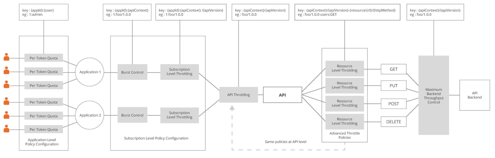
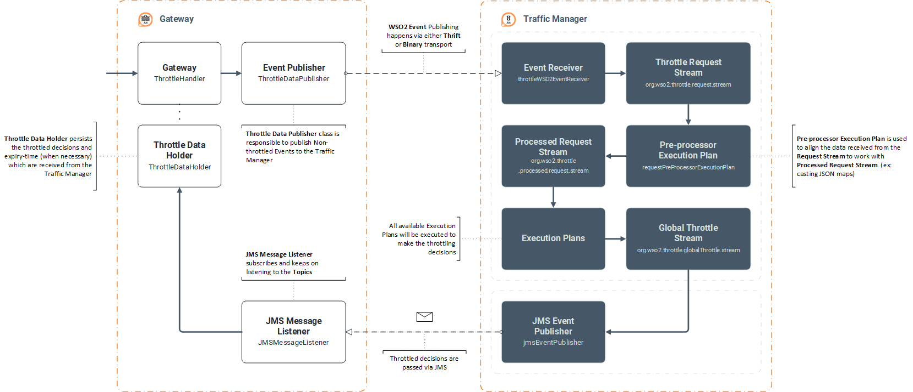
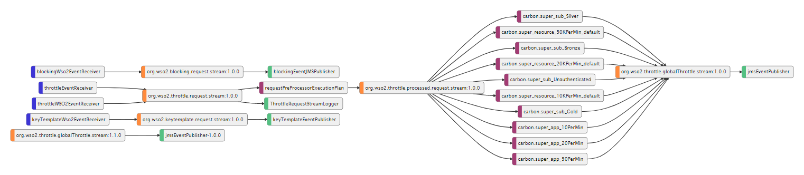

# Demystifying Throttling Execution Flow

In this article, we will be demystifying the Throttling execution flow of the WSO2 API Manager. The following sections of this article are divided into pieces presenting a brief introduction to the Throttling features and then explaining the execution flow of Throttling during the runtime along with a set of samples and dry-runs. The article concludes with a set of guides and instructions on troubleshooting the Throttling feature of WSO2 API Manager.

Throttling is one of a key feature that is shipped out-of-the-box by the WSO2 API Manager server to control the rate of API requests received at the API Manager. This also helps to secure the APIs and the servers from DOS attacks.

WSO2 API Manager delivers a set of tiers/levels where Throttling policies can be applied. Following are the three main levels of throttling supported by the WSO2 API Manager

* Advanced Level Throttling

    Advanced-level throttling policies are used and engaged at the API level or the API Resource level when designing the API. We can assign a set of conditional groups based on transport-level headers, JWT claims, IP addresses and etc. to conditionaly throttle the APIs.

    Learn more about Advanced-level throttling policies and examples in here [[1]](https://docs.wso2.com/display/AM260/Introducing+Throttling+Use-Cases#IntroducingThrottlingUse-Cases-Advancedthrottlingpolicies:APIPublisher).

* Subscription Level Throttling

    Subscription-level throttling policies are engaged at the level of API subscriptions. These policies are defined per API by the API creator/publisher when designing the APIs with WSO2 API Manager. We can also configure burst-control limits with these policies to control the number of requests can be recevied by the Gateway component at a second. This is also known as Rate-limiting in WSO2 API Manager.

    Learn more about Subscription-level throttling policies and examples in here [[2]](https://docs.wso2.com/display/AM260/Introducing+Throttling+Use-Cases#IntroducingThrottlingUse-Cases-Subscriptiontiers:APIPublisher).

* Application Level Throttling

    Application-level throttling policies (also known as Per-Token Quota) are engaged at the Application level by the API developer.

    Learn more about Application-level throttling policies and use-cases in here [[3]](https://docs.wso2.com/display/AM260/Introducing+Throttling+Use-Cases#IntroducingThrottlingUse-Cases-Pertokenquota:ApplicationDeveloper).

In addition to the above-briefed throttling levels, the WSO2 API Manager also delivers the following features to achieve throttling and to control API executions

* [Backend throughput limit](https://docs.wso2.com/display/AM260/Setting+Maximum+Backend+Throughput+Limits)
* [Blocking conditions](https://docs.wso2.com/display/AM260/Managing+Throttling#ManagingThrottling-Blacklistingrequests)
* [Custom Throttling execution policies](https://docs.wso2.com/display/AM260/Adding+New+Throttling+Policies#AddingNewThrottlingPolicies-Addingacustomthrottlingpolicy)

Given below is a high-level diagram representing the engaged Throttling policies and tiers at each level of an API execution flow



Learn more about Throttling and other provided features of the WSO2 API Manager here [[4]](https://docs.wso2.com/display/AM260/Working+with+Throttling).

Before proceeding with the demystification, let's get an understanding about the WSO2 API Manager and its components. The WSO2 API Manager is built with 5 major components that can be distributed individually to scale and control the process API Management. Following are the key components of the WSO2 API Manager

1. Gateway
2. Publisher
3. Store/Devportal
4. Key Manager
5. Traffic Manager

<!-- TODO: have to fill this gap by specifiying the Components involved in Throttling -->
<!-- TODO: have to say that we are going to understand the normal throttling execution flow -->

Giving a high-level understanding on the above-mentioned components, the ...

* Gateway component is used to serve the API requests
* Publisher component is used to create and publish the APIs. It also acts as the Admin portal to manage the Throttling execution policies
* Store component is used to subscribe and view the published APIs
* Key Manager component is used to perform API authentication and authorization
* Traffic Manager component is used to perform and evaluate Throttling decisions

Since we are here to demystify the Throttling execution flows, we will be mainly focusing on the Gateway and Traffic Manager components and its modules on achieveing the Throttling during the runtime. Further, we will have a look into other components based on their interactions and priorities during the execution flows.

## API Throttling

Let's talk about the API Throttling execution flow.

During runtime, the Gateway component communicates with the Traffic Manager component to asses the throttling decision. The below presented is a high-level diagram plotting the internal modules of component and the communication flow during Throttling



Follow the article along with the shared execution flow diagram to get more clear understanding of the Throttling execution flow.

The Gateway component contains an in-built Synapse runtime to process and serve the API calls. All published APIs are persisted in the Gateway component as in the form Synapse artifacts. These artifacts can be found under the `<apim>/repository/deployment/server/synapse-configs` directory of the Gateway node. Attached is a sample API Synapse artifact of an API called Throttle-Me

```xml
<?xml version="1.0" encoding="UTF-8"?>
<api xmlns="http://ws.apache.org/ns/synapse" name="admin--ThrottleMeAPI" 
     context="/throttle/me/1.0.0" version="1.0.0" version-type="context">
   <resource methods="GET" url-mapping="/" faultSequence="fault">
      <inSequence>
         <property name="api.ut.backendRequestTime" expression="get-property('SYSTEM_TIME')"/>
         <filter source="$ctx:AM_KEY_TYPE" regex="PRODUCTION">
            <then>
               <send>
                  <endpoint key="ThrottleMeAPI--v1.0.0_APIproductionEndpoint"/>
               </send>
            </then>
         </filter>
      </inSequence>
      <outSequence>
         <class name="org.wso2.carbon.apimgt.gateway.handlers.analytics.APIMgtResponseHandler"/>
         <send/>
      </outSequence>
   </resource>
   <handlers>
      <handler class="org.wso2.carbon.apimgt.gateway.handlers.common.APIMgtLatencyStatsHandler"/>
      <handler class="org.wso2.carbon.apimgt.gateway.handlers.security.CORSRequestHandler">
         <property name="apiImplementationType" value="ENDPOINT"/>
      </handler>
      <handler class="org.wso2.carbon.apimgt.gateway.handlers.security.APIAuthenticationHandler">
         <property name="RemoveOAuthHeadersFromOutMessage" value="true"/>
      </handler>
      <handler class="org.wso2.carbon.apimgt.gateway.handlers.throttling.ThrottleHandler"/>
      <handler class="org.wso2.carbon.apimgt.gateway.handlers.analytics.APIMgtUsageHandler"/>
      <handler class="org.wso2.carbon.apimgt.gateway.handlers.ext.APIManagerExtensionHandler"/>
   </handlers>
</api>
```

The API Synapse artifacts are the API definitions for the Gateway component to process and serve API requests. Each API Synapse artifact will contain the API resource definitions of that particular API and a set of standard handlers. Handlers are used to perform various operations such as API authentication, Throttling, Analytics, and etc. during an API execution. The order of specifying the Handlers in a Synapse artifact is important because, the Handlers are executed sequentially in the same order as they are presented in the Synapse artifacts.

As briefed earlier, the Gateway component uses all specified Handlers in a Synapse artifact to perform authentication, throttling and etc. For instance, the API Authentication Handler is used to authenticate and allow the API requests. The Throttle Handler is used to perform API throttling.

Now, let's understand the Throttling execution flow. In the following sections, the Throttling execution flow is demonstrated in points starting from the API invocation to a complete cycle.

When an API request reaches the API Manager Gateway, the in-built Synapse runtime finds the respective API Synapse artifact and starts executing the Handlers that are defined in the Synapse artifact in the same order.

1. The API Authentication Handler gets executed to validate the security token passed along with the API request with the Key Manager component. The API Authentication Handler invokes the API Key-validation service to communicate with the Key Manager component to validate the security token. In response, the Key Manager sends back the validity of the presented security token and a collection of data particular to that API.
2. Once the API Authentication is successful, the message context is passed to the Throttle Handler to construct and evaluate the throttling conditions.

   <a name="point-2-1"></a>

   1. Throttle Handler uses the passed message context to construct an event that can be published to the Traffic Manager to evaluate the throttling decision. Along with the construction of the data-bundle, the Throttle Handler also traverse through a set of conditions to verify whether there have been any pre-taken throttling decisions or blocking conditions present for the specific API invocation.
      * Gateway contains a temporary map named Throttle Data Holder to store the throttling decisions and the blocking conditions locally.

         This helps the Gateway component to throttle the following API invocations of the respective API without making any communication with the Traffic Manager component. We'll get to more understanding on this along with the execution flow.

   2. Let's assume that this is the very first API invocation to the Gateway and there are no any throttling decisions or blocking conditions presented for the specific API at the Gateway. Once the required data is collected by the Throttle Handler, the constructed data-bundle is passed to the Event Publisher of the Gateway component to re-organize and build an event to publish to the Traffic Manager.
   3. Event Publisher constructs an event using the data-bundle and passes the event to the Throttle Data Publisher. Throttle Data Publisher then publishes the constructed event to the Traffic Manager using one of the configured transport types; Binary or Thrift.
3. Traffic Manager contains a pre-configured Event Receiver in it. The Event Receiver is responsible to collect and pass the event data through a set of Event Streams. To be more precise, Traffic Manager uses the Throttle-WSO2-Event-Receiver to receive the events and routes the received event data to the Throttle Request Stream.

   Attached is a high level diagram explaining the communications and passages between all deployed event receivers, streams, and publishers in the Traffic Manager component

   

4. A pre-processor execution plan is deployed at the Traffic Manager component to pre-process the received event data. The pre-processor execution plan can be found under `<tm>/repository/deployment/server/executionplans` directory with the name Request Pre-Processor Execution Plan. The pre-processor execution plan is implemented to listen to the Throttle Request Stream and then to pass the processed data to the Throttle Processed Request Stream.
5. All deployed Throttling execution policies are designed in a way to listen to the Throttle Processed Request Stream. Given below is the Gold Subscription tier policy

   ```sql
   /* Enter a unique ExecutionPlan */
   @Plan:name('carbon.super_sub_Gold')

   /* Enter a unique description for ExecutionPlan */
   @Plan:description('ExecutionPlan for sub_gold')

   /* define streams/tables and write queries here ... */

   @Import('org.wso2.throttle.processed.request.stream:1.0.0')
   define stream RequestStream (messageID string, appKey string, appTier string, subscriptionKey string, apiKey string, apiTier string, subscriptionTier string, resourceKey string, resourceTier string, userId string, apiContext string, apiVersion string, appTenant string, apiTenant string, appId string, apiName string, propertiesMap string);

   @Export('org.wso2.throttle.globalThrottle.stream:1.0.0')
   define stream GlobalThrottleStream (throttleKey string, isThrottled bool, expiryTimeStamp long);

   FROM RequestStream
   SELECT messageID, ( apiTenant == 'carbon.super' and subscriptionTier == 'Gold') AS isEligible, subscriptionKey AS throttleKey
   INSERT INTO EligibilityStream;

   FROM EligibilityStream[isEligible==true]#throttler:timeBatch(1 min, 0)
   select throttleKey, (count(messageID) >= 5000) as isThrottled, expiryTimeStamp
   group by throttleKey
   INSERT ALL EVENTS into ResultStream;

   from ResultStream#throttler:emitOnStateChange(throttleKey, isThrottled)
   select *
   insert into GlobalThrottleStream;
   ```

   1. The processed data is queried from the Throttle Processed Request Stream by the execution policies and evaluated against a set of conditions to verify whether they are eligible or not to continue with the throttling evaluation process.

      Explaining more, all deployed Execution Policies are processed when an event is passed to the Traffic Manager. Therefore, the execution policies have to query and evaluate the received data as eligible or not to continue forward with the throttling calculations. Each execution policy deployed at the Traffic Manager contains a set of condition to validate the eligibility. Given is an extract from the Gold Subscription tier policy to evaluate whether the received event is eligible to be processed by the Gold Subscription tier execution policy or not.

      ```sql
      FROM RequestStream
      SELECT messageID, ( apiTenant == 'carbon.super' and subscriptionTier == 'Gold') AS isEligible, subscriptionKey AS throttleKey
      INSERT INTO EligibilityStream;
      ```

   2. After the initial evaluation, the data is put to a local stream named Eligibility Stream.
   3. Then, the processed data is queried from the local Eligibility Stream and verified whether it has been marked as eligible or not. If the data is identified as eligible, then the respective execution policy starts to evaluate the throttling decision.

      Given is an extract of the Gold Subscription tier execution policy where the throttling decision is evaluated upon checking the count of the API requests received within the specified time period

      ```sql
      FROM EligibilityStream[isEligible==true]#throttler:timeBatch(1 min, 0)
      select throttleKey, (count(messageID) >= 5000) as isThrottled, expiryTimeStamp
      group by throttleKey
      INSERT ALL EVENTS into ResultStream;
      ```

      Learn more about the SiddhiQL syntaxes and functions in here [].

   4. Once the throttling decision is assessed, the events are put into a Result Stream.
   5. And then, the event is acquired from the Result Stream and passed to the Global Throttle Stream. The data transfer from Result Stream to the Global Throttle Stream will only happen when there is a state change observed in the `isThrottled` property. In other words, the Traffic Manager component will send the throttling decision via JMS message to the Gateway only when there is a state change observed in the `isThrottled` property. For more understanding, please find the extracted SiddhiQL of the Gold Subscription tier policy

      ```sql
      from ResultStream#throttler:emitOnStateChange(throttleKey, isThrottled)
      select *
      insert into GlobalThrottleStream;
      ```

      The `emitOnStateChange` function is responsible to compute and transfer the data from the Result Stream to the Global Throttle Stream whenever there is a state change is observed. This helps minimizing the number of events communicated from Traffic Manager to the Gateway during the runtime besides sending all assessed decisions to the Gateway.

6. An Event Publisher named JMS Event Publisher is configured and deployed at the Traffic Manager to listen to the Global Throttle Stream and to send those data as a JMS message to its subscribed Gateways (clients)
7. Gateway component receives the JMS message with the help of JMS Message Listener module that is compiled inside the Gateway component.

   Given below is a sample JMS message logged at the Gateway component upon receiving

   ```log
   TID: [-1] [] [2020-09-26 20:50:55,446] DEBUG {org.wso2.carbon.apimgt.jms.listener.utils.JMSMessageListener} -  Event received in JMS Event Receiver - Body:
   {isThrottled=true, throttleKey=1:/pizzashack/1.0.0:1.0.0, expiryTimeStamp=1601133660000}
   JMS Correlation ID: null
   JMS timestamp: 1601133654440
   JMS expiration: 0
   JMS priority: 4
   JMS delivery mode: 2
   JMS reply to: null
   JMS Redelivered: false
   JMS Destination: topic://amq.topic/throttledata/?routingkey='throttledata'&exclusive='true'&autodelete='true'
   JMS Type: null
   JMS MessageID: ID:4d8c0613-625f-3341-a1ce-6c2e6df59c32
   JMS Content-Type: amqp/map
   AMQ message number: 7
   Properties:
   JMS_QPID_DESTTYPE = 2
   {org.wso2.carbon.apimgt.jms.listener.utils.JMSMessageListener}

   TID: [-1] [] [2020-09-26 20:50:55,446] DEBUG {org.wso2.carbon.apimgt.jms.listener.utils.JMSMessageListener} -  Received Key -  throttleKey : 1:/pizzashack/1.0.0:1.0.0 , isThrottled :true , expiryTime : Sat Sep 26 20:51:00 IST 2020 {org.wso2.carbon.apimgt.jms.listener.utils.JMSMessageListener}
   ```

8. Upon a successful receive, the Gateway component deconstructs the received message and sends the required data such as `throttleKey`, `isThrottled`, and `expiryTimeStamp` values to the Throttle Data Holder map to persist the decisions temporarily at the Gateway side.

   As explained in [Point:2.1.](#point-2-1), the Gateway component uses the data that are persisted in the Throttle Data Holder map to throttle the upcoming API requests from the Gateway node itself without communicating with the Traffic Manager components.

   The Throttle Data Holder map uses the collected `expiryTimeStamp` values to evaluate the validity of the received throttling decisions.

<!-- TODO: finish the sections -->

## Blocking Conditions

<!-- TODO: write about the Blocking Conditions -->

## Troubleshoot Guide

This portion of this article presents a set of steps and instructions to troubleshoot the Throttling execution flow. The guide is partitioned into pieces as following

* Throttling process at Gateway
  * Enabling debug logs for Throttle Handler
  * Enabling debug logs for Throttle Data Publisher
* Throttling process at Traffic Manager
  * Adding loggers for Throttle Request Stream
  * Adding loggers for Global Throttle Stream
* Receiving JMS message at Gateway

### Throttling process at Gateway

#### Enabling debug logs for Throttle Handler

We can enable debug logs in the Throttle Handler to print enough traces about the process and evaluation taken place in the Gateway component prior to communication with Traffic Manager component.

Add the following property line inside the `<apim-gateway>/repository/conf/log4j.properties` to enable the debug logs for the Throttle Handler

> Please note the following configuration changes requires a server restart

```properties
log4j.logger.org.wso2.carbon.apimgt.gateway.handlers.throttling.ThrottleHandler=DEBUG
```

We can also enable the debug logs by signing-in to the Carbon Management console of the Gateway component; and this not requires a server restart. Please follow the given steps

1. Sign-in to the Carbon Management console of the Gateway node
2. Go to Configure > Logging
3. Under `Configure Log4j Loggers`, search for `ThrottleHandler` and search with `Contains`
4. Select the log level from `INFO` to `DEBUG` and click on `Ok`

#### Enabling debug logs for Throttle Data Publisher

Enable debug logs for the Throttle Data Publisher module in the Gateway component to trace the data publishing process from Gateway component to Traffic Manager.

Add the following property line inside the `<apim-gateway>/repository/conf/log4j.properties` and restart the Gateway server to enable the debug logs

```properties
log4j.logger.org.wso2.carbon.apimgt.gateway.throttling.publisher.ThrottleDataPublisher=DEBUG
```

The above debug logs will produce the following traces in the `wso2carbon.log` when data publishing is performed from the Gateway component to Traffic Manager.

```log
TID: [-1234] [] [2020-09-26 20:50:50,294] DEBUG {org.wso2.carbon.apimgt.gateway.throttling.publisher.ThrottleDataPublisher} -  Publishing throttle data from gateway to traffic-manager for: /pizzashack/1.0.0 with ID: urn:uuid:a8481cd8-9027-4580-97db-c2350baf8262 started at [2020.09.26 20:50:50,294 IST] {org.wso2.carbon.apimgt.gateway.throttling.publisher.ThrottleDataPublisher}

TID: [-1234] [] [2020-09-26 20:50:50,294] DEBUG {org.wso2.carbon.apimgt.gateway.throttling.publisher.ThrottleDataPublisher} -  Publishing throttle data from gateway to traffic-manager for: /pizzashack/1.0.0 with ID: urn:uuid:a8481cd8-9027-4580-97db-c2350baf8262 ended at [2020.09.26 20:50:50,294 IST] {org.wso2.carbon.apimgt.gateway.throttling.publisher.ThrottleDataPublisher}
```

We can also enable the debug logs by signing-in to the Carbon Management console of the Gateway component; and this not requires a server restart. Please follow the given steps

1. Sign-in to the Carbon Management console of the Gateway node
2. Go to Configure > Logging
3. Under `Configure Log4j Loggers`, search for `ThrottleDataPublisher` and search with `Contains`
4. Select the log level from `INFO` to `DEBUG` and click on `Ok`

### Throttling process at Traffic Manager

#### Adding loggers for Throttle Request Stream

To verify whether an event sent from Gateway has been received by the Traffic Manager, we can add and enable loggers to the Throtttle Request Stream. Please follow the given instructions to add and enable loggers in the Traffic Manager node

1. Sign-in to the Carbon Management console of the Traffic Manager node
2. Go to Main > Manage > Event > Publishers and click on `Add Event Publisher`
3. Provide a name for our Logger Event Publisher (ex: RequestStreamLogger)
4. Select the `Event Source` as `org.wso2.throttle.request.stream:1.0.0` from the dropdown
5. Select the `Output Event Adapter Type` as `logger`
6. Add a `Unique Identifier` if required and select the `Message Format` as per your preference (given below is JSON formatted)
7. Click on `Add Event Publisher` to save and add the event publisher

Once the logger event publisher is added and enabled at the Traffic Manager component, we will receive the following traces whenever the Traffic Manager receives an event from the Gateway component.

```log
ID: [-1234] [] [2020-09-26 20:50:50,297]  INFO {org.wso2.carbon.event.output.adapter.logger.LoggerEventAdapter} -  Unique ID: RequestStreamLogger,
 Event: {"event":{"payloadData":{"messageID":"urn:uuid:a8481cd8-9027-4580-97db-c2350baf8262","appKey":"1:admin@carbon.super","appTier":"Unlimited","apiKey":"/pizzashack/1.0.0:1.0.0","apiTier":null,"subscriptionKey":"1:/pizzashack/1.0.0:1.0.0","subscriptionTier":"3ReqPerMin","resourceKey":"/pizzashack/1.0.0/1.0.0/menu:GET","resourceTier":"Unlimited","userId":"admin@carbon.super","apiContext":"/pizzashack/1.0.0","apiVersion":"1.0.0","appTenant":"carbon.super","apiTenant":"carbon.super","appId":"1","apiName":"PizzaShackAPI","properties":"{"ip":3232260865}"}}} {org.wso2.carbon.event.output.adapter.logger.LoggerEventAdapter}
```

#### Adding loggers for Global Throttle Stream

```log
TID: [-1234] [] [2020-09-26 20:50:54,928]  INFO {org.wso2.carbon.event.output.adapter.logger.LoggerEventAdapter} -  Unique ID: GlobalRequestStreamLogger,
 Event: {"event":{"payloadData":{"throttleKey":"1:/pizzashack/1.0.0:1.0.0","isThrottled":true,"expiryTimeStamp":1601133660000}}} {org.wso2.carbon.event.output.adapter.logger.LoggerEventAdapter}
```

### Receiving JMS message at Gateway

```properties
log4j.logger.org.wso2.carbon.apimgt.jms.listener.utils.JMSMessageListener=DEBUG
```

```log
TID: [-1] [] [2020-09-26 20:50:55,446] DEBUG {org.wso2.carbon.apimgt.jms.listener.utils.JMSMessageListener} -  Event received in JMS Event Receiver - Body:
{isThrottled=true, throttleKey=1:/pizzashack/1.0.0:1.0.0, expiryTimeStamp=1601133660000}
JMS Correlation ID: null
JMS timestamp: 1601133654440
JMS expiration: 0
JMS priority: 4
JMS delivery mode: 2
JMS reply to: null
JMS Redelivered: false
JMS Destination: topic://amq.topic/throttledata/?routingkey='throttledata'&exclusive='true'&autodelete='true'
JMS Type: null
JMS MessageID: ID:4d8c0613-625f-3341-a1ce-6c2e6df59c32
JMS Content-Type: amqp/map
AMQ message number: 7
Properties:
JMS_QPID_DESTTYPE = 2
{org.wso2.carbon.apimgt.jms.listener.utils.JMSMessageListener}

TID: [-1] [] [2020-09-26 20:50:55,446] DEBUG {org.wso2.carbon.apimgt.jms.listener.utils.JMSMessageListener} -  Received Key -  throttleKey : 1:/pizzashack/1.0.0:1.0.0 , isThrottled :true , expiryTime : Sat Sep 26 20:51:00 IST 2020 {org.wso2.carbon.apimgt.jms.listener.utils.JMSMessageListener}
```

---

## References

* [1] : [https://docs.wso2.com/display/AM260/Introducing+Throttling+Use-Cases#IntroducingThrottlingUse-Cases-Advancedthrottlingpolicies:APIPublisher](https://docs.wso2.com/display/AM260/Introducing+Throttling+Use-Cases#IntroducingThrottlingUse-Cases-Advancedthrottlingpolicies:APIPublisher)
* [2] : [https://docs.wso2.com/display/AM260/Introducing+Throttling+Use-Cases#IntroducingThrottlingUse-Cases-Subscriptiontiers:APIPublisher](https://docs.wso2.com/display/AM260/Introducing+Throttling+Use-Cases#IntroducingThrottlingUse-Cases-Subscriptiontiers:APIPublisher)
* [3] : [https://docs.wso2.com/display/AM260/Introducing+Throttling+Use-Cases#IntroducingThrottlingUse-Cases-Pertokenquota:ApplicationDeveloper](https://docs.wso2.com/display/AM260/Introducing+Throttling+Use-Cases#IntroducingThrottlingUse-Cases-Pertokenquota:ApplicationDeveloper)
* [4] : [https://docs.wso2.com/display/AM260/Working+with+Throttling](https://docs.wso2.com/display/AM260/Working+with+Throttling)
