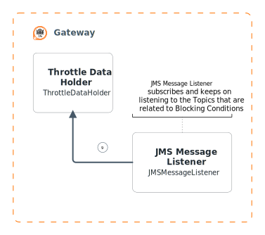
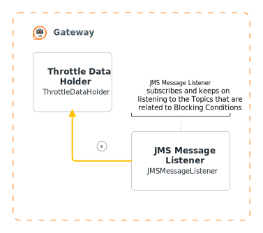

There were some contents here

<SVGWave>

Create an express application by executing `npm init` command, and provide all necessary properties to start the development.

Install all below-listed dependencies by either running `npm install <module> --save` command or by replacing the dependencies object with the values.

A complete package.json is given below.

[Passport](http://www.passportjs.org) is authentication middleware for Node.js and can be used with any Express-based web applications.

> Passport has a comprehensive set of strategies to support different authentication mechanisms with different vendors.

For this implementation, we will be using [Passport-SAML](http://www.passportjs.org/packages/passport-saml) (which is an open-built strategy for SAML 2.0 authentication flows) strategy with our express web application to authenticate users.

Given below is a simple [Passport-SAML](http://www.passportjs.org/packages/passport-saml) strategy configuration …

</SVGWave>

<SVGWave align="right">

And click *Register* to register and create a new service provider. Afterward, the management console will display you the following screen to configure claim configuration, inbound authentication configurations and etc.

Expand the *Claim Configurations (accordion)* to configure wanted claims and subject claim URI. We will be using the *Local Claim Dialect* as the *Claim mapping Dialect*.

> You can add all your wanted (requested claims) by clicking on the Add Claim URI button and selecting one from the drop-down menu

For the demo, we will be selecting the following claims

Next, expand the *Inbound Authentication Configuration (accordion)* and click on *SAML2 Web SSO Configuration* and select *Configure* to configure SAML web SSO for our implemented express application.

Configure the SAML SSO as follows …

* Issuer: `SampleExpressApp`
* Assertion Consumer URLs: `http://localhost:3000/saml/consume`
* Enable Response Signing: `True`
* Enable Signature Validation in Authentication Requests and Logout Requests: False

> To enable signature validate in both authentication requests and logout requests, please refer the `Certificates and Signing` section.

* Enable Single Logout: `True`
* SLO Response URL: `http://localhost:3000/app/home`
* SLO Request URL: `http://localhost:3000/app/home`
* Enable Attribute Profile: `True`
* Include Attributes in the Response Always: `True`

</SVGWave>

End of contents
